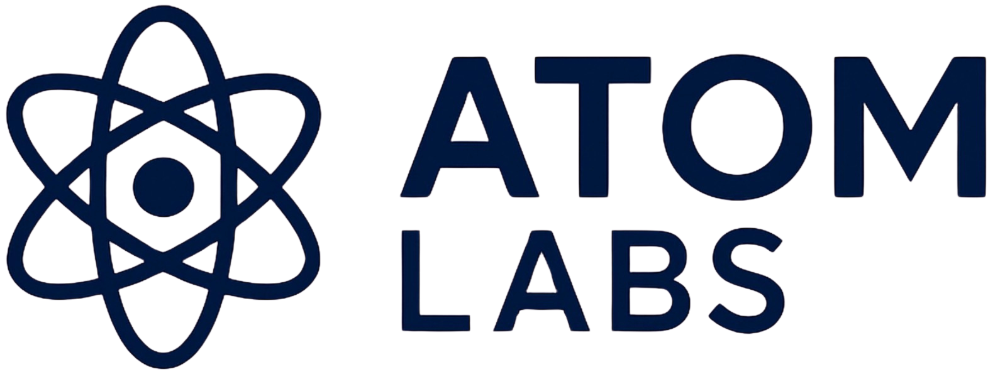

  

<h1 align="center" style="font-weight:700; font-size:42px; margin-bottom:6px; letter-spacing:-0.4px;">
  The Global Reasoning Integrity Standard for the Autonomous Age
</h1>

  Reasoning Integrity, defined and measurable. RIS provides a formal, enterprise-grade framework for evaluating and governing
  the stability, predictability, and structural reliability of AI reasoning across models, agents, and cognitive systems.

  Developed and maintained by <strong>Atom Labs - Standards Division</strong>.

---

# 1. What RIS is

The **Reasoning Integrity Standard (RIS)** is the first formal framework dedicated to measuring the integrity of AI reasoning itself.

Where existing frameworks govern:

- security  
- privacy  
- compliance  
- safety  

RIS governs **how a system reasons** - whether its internal reasoning process is stable, coherent, bounded, and auditable under real-world conditions.

RIS v1.0 defines:

- a multi-level reasoning integrity model (RIS-0 → RIS-4)  
- a measurement framework and scoring methodology  
- mandatory controls and governance requirements  
- evaluation and audit procedures  
- a reference implementation (LCAC) and operational pipeline  

The objective is simple:

> Make AI reasoning integrity a measurable, reportable, and certifiable property.

---

# 2. Why RIS Exists

Modern AI systems exhibit powerful but fragile reasoning behaviour:

- reasoning chains can drift over time and context  
- identical prompts can produce materially different reasoning paths  
- multi-agent systems amplify variance and drift  
- tool calls, memory, and upstream systems influence reasoning in opaque ways  
- most organizations have no standard way to assess reasoning stability  

This creates structural gaps in:

- safety-critical deployments  
- enterprise risk and governance  
- procurement and vendor due diligence  
- model change management and regression testing  
- regulatory expectations around AI behaviour  

**RIS closes this gap.** It provides a concrete, testable standard for reasoning stability and governance.

---

# 3. RIS in the Atom Labs Ecosystem

RIS is the cornerstone of Atom Labs’ reasoning governance stack:

- **RIS Standard**  
  Formal specification, controls, levels, and methodology.

- **RIS Evaluator**  
  Scoring engine and pipeline that executes RIS evaluations and generates scorecards.

- **LCAC (Least-Context Access Control)** - Reference Implementation  
  Operationalizes reasoning governance, drift analysis, stability thresholds, and scorecard generation.

- **LCAC Governor**  
  Cognitive policy engine that monitors models in production, tracks drift and variance, and can gate decisions based on RIS-aligned thresholds.

- **RIS Portal**  
  This documentation + analytics portal, surfacing reports, leaderboards, badges, and CII (Cognitive Integrity Index).

- **RIS Certification & Submission** (v1.1+)  
  Formalized certification workflows, templates, and checklists for internal and external models.

- **Future Atom Labs Stack**  
  RIS integrated across Atom Labs systems: LCAC, VANTA OS, Markets Intelligence, Executor Engine, and cognitive observability services.

RIS anchors the entire ecosystem as the **standard of record** for reasoning stability.

---

# 4. RIS Levels

RIS defines five integrity levels:

| Level | Name                                       | Summary                                              |
|-------|--------------------------------------------|------------------------------------------------------|
| RIS-0 | Uncontrolled Reasoning                     | No stability guarantees; unsuitable for critical use |
| RIS-1 | Drift-Sensitive Reasoning                  | Highly sensitive to context and perturbation         |
| RIS-2 | Semi-Stable Reasoning                      | Partially consistent; acceptable for low-risk flows  |
| RIS-3 | Controlled, Production-Grade Reasoning     | Stable within defined envelopes; enterprise-ready    |
| RIS-4 | High-Integrity, Safety-Critical Reasoning  | Strictly controlled; auditable for regulated use     |

Each level carries:

- eligibility criteria  
- required controls  
- evidence expectations  
- variance / drift parameters  
- governance implications  

Level selection is a **risk decision**, not just a technical metric.

---

# 5. Measurement Pillars

RIS evaluations cover five core pillars:

1. **Chain Stability**  
   Reliability of multi-step reasoning across sessions, users, and contexts.

2. **Semantic Coherence**  
   Internal logical consistency and structural quality of reasoning outputs.

3. **Drift Sensitivity**  
   How easily reasoning degrades due to time, prompt changes, data shifts, tools, or configuration.

4. **Variance Envelope Compliance**  
   Predictability of reasoning within an acceptable variance band under repeated evaluation.

5. **Boundary Governance**  
   Adherence to defined operational, ethical, and safety boundaries.

Together, these pillars determine whether a system’s reasoning can be trusted in production and regulated environments.

---

# 6. RIS Evaluation Pipeline

A typical RIS evaluation workflow consists of:

1. **Scenario and sample design**  
2. **Baseline runs for chain stability**  
3. **Perturbation runs for drift and variance**  
4. **Semantic coherence scoring**  
5. **Boundary and control checks**  
6. **Aggregation into RIS metrics and indicators**  
7. **RIS Level assignment (0-4)**  
8. **Scorecard and report generation**  
9. **Optional CII (Cognitive Integrity Index) computation**  
10. **Publication to RIS Portal or internal systems**

The RIS Evaluator and LCAC implementation provide reference execution pipelines for this flow, backed by Redis and LCAC governance metadata when deployed in the full Atom Labs stack.

---

# 7. Quick Entry Points

Use this portal to:

- **Read the Standard**  
  Use the left navigation to access Sections 0–13 (Levels, Controls, Methodology, Risk, Audit, Mapping).

- **Review Overview and Concepts**  
  See the narrative introduction in  
  _Overview → Reasoning Integrity Standard (RIS) - Overview_.

- **Explore Analytics**  
  View sample and live evaluations under _Analytics_ → Reports, Leaderboard, Badges, and CII.

- **Plan Integration**  
  Use the API, SDK, and CICD integration guides to map RIS into your environment.

- **Prepare for Certification** (v1.1+)  
  Align with the RIS Certification Program, Conformance Statement, and Evaluation Report templates.

---

# 8. RIS + LCAC + Governor: Operational Path

In a full Atom Labs deployment, RIS connects to runtime systems as follows:

- **RIS Standard** defines the target behaviour and controls.  
- **LCAC Evaluator** runs structured benchmark suites and stability tests.  
- **LCAC Governor** watches model behaviour in production, using RIS-aware metrics and drift indicators.  
- **Redis / telemetry layer** tracks key metrics and historical scorecard data.  
- **RIS Portal** presents reports, leaderboards, and integrity trends.  
- **Enterprise systems** (e.g., VANTA OS, Markets Intelligence, Executor Engine) can consume RIS levels and stability metrics as inputs to decision logic.

This layout allows organizations to go from **benchmark** → **monitor** → **govern** with a single conceptual standard.

---

# 9. Who RIS is For

RIS is intended for:

- enterprise AI teams deploying LLMs and agentic systems  
- governance, risk, and compliance functions  
- safety and assurance organizations  
- engineering and MLOps teams building cognitive infrastructure  
- research labs studying reasoning drift and stability  
- vendors seeking demonstrable reasoning guarantees  
- regulators and auditors needing structured reasoning evidence  

If reasoning instability has a cost, RIS creates a way to measure and mitigate it.

---

# 10. Relationship to Existing Standards

RIS is explicitly designed to complement, not replace, existing frameworks:

- NIST SP 800-53 (security control baselines)  
- ISO/IEC 27001 (information security management)  
- SOC 2 (service organization controls)  
- OWASP ASVS (application security verification)  
- NIST AI RMF (AI risk management)  
- EU AI Act (regulatory structure for AI systems)  

Those frameworks govern security, privacy, and general AI risk.  
**RIS introduces a dedicated reasoning integrity layer.**

---

# 11. How to Adopt RIS

Typical adoption path:

1. **Internal Analysis**  
   Review the standard, levels, and measurement framework.

2. **Pilot Evaluation**  
   Run RIS evaluations against one or more internal systems using the benchmark guide and integration docs.

3. **Establish Internal Targets**  
   Define required RIS levels per use case (e.g., RIS-2 for low-impact, RIS-3 or RIS-4 for regulated workflows).

4. **Integrate with Governance**  
   Link RIS results with model registries, incident management, change management, and vendor review processes.

5. **Continuous Evaluation**  
   Extend RIS into CI/CD and runtime via LCAC and the Governor, including drift detection and long-horizon monitoring.

6. **External Alignment and Certification** (optional)  
   Engage with Atom Labs for RIS Certification, evidence review, and audit-grade scorecards.

---

# 12. Citation

When citing RIS:

**Reasoning Integrity Standard (RIS) v1.0**  
Atom Labs, 2025  
https://github.com/qstackfield/ris-standard

---

# 13. Contact

For collaboration, contributions, certification, or ecosystem integration:

**Atom Labs - Standards Division**  
Email: **RIS@atomlabs.app**  
GitHub: **https://github.com/qstackfield**

---
